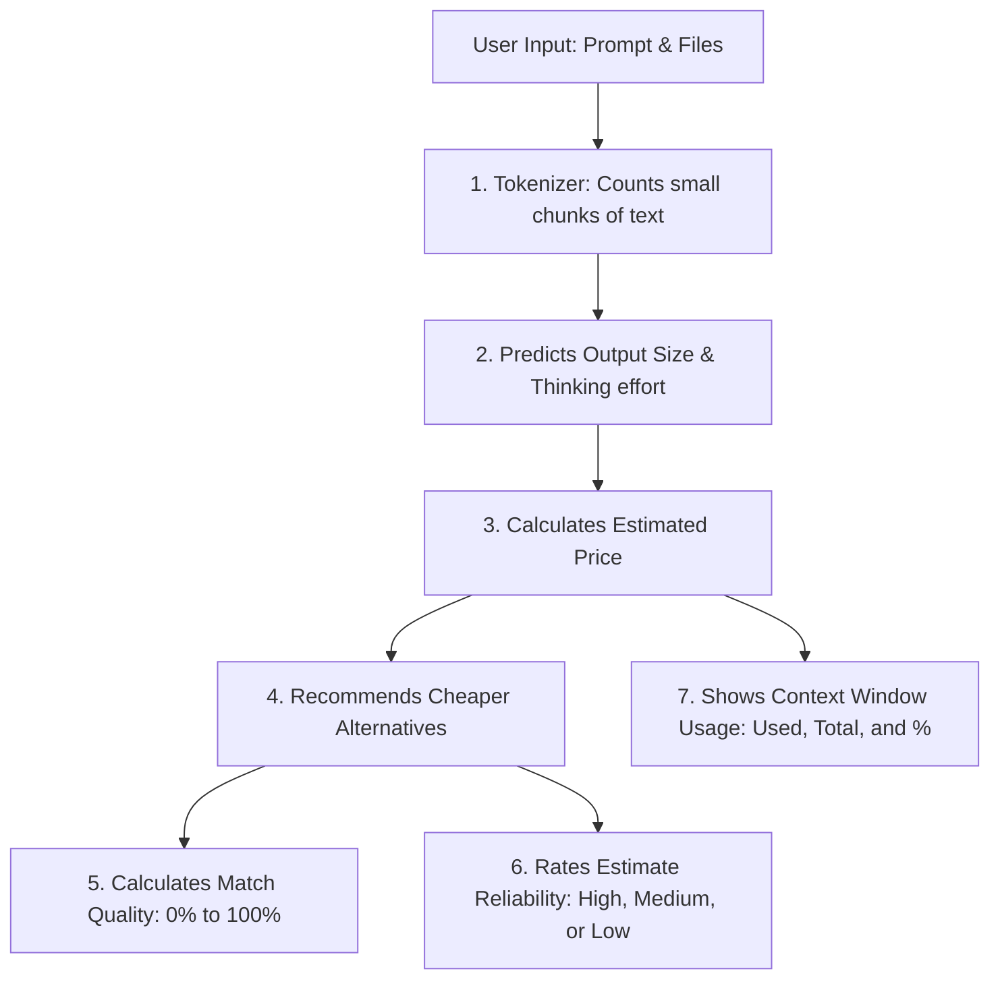

# TokenOptimizer Product One-Pager

## 1. Executive Summary

TokenOptimizer is a full-stack web application that helps users estimate LLM usage cost before running a prompt. It shows prompt and file token impact, likely answer size, optional thinking-mode overhead, selected model pricing, catalog freshness, and quality-preserving model or prompt alternatives. It also includes an optional request-key quality sweep for users who want evidence, not only estimates.

The current MVP is a React frontend and Express backend. It is no longer dependent on n8n. The backend performs native estimation, uses a refreshable live OpenRouter model catalog, and falls back to deterministic logic when optional OpenRouter estimator calls are unavailable.

## 2. What Problem It Solves

LLM users often do not know the cost of a prompt until after it runs. Cost becomes harder to predict when the prompt is long, files are attached, premium models are selected, or reasoning modes like `Pro`, `Thinking`, or custom token budgets are used.

TokenOptimizer solves this by giving users a pre-flight cost view before execution. It helps answer:

- How large is my prompt and file input?
- What kind of output is this prompt likely asking for?
- How long might the answer be?
- How much extra thinking-mode cost might apply?
- Is there a better model, mode, or prompt structure that saves money while preserving useful output quality?

## 3. Why It Is Important

As AI usage grows across individuals and teams, small model and prompt choices can create meaningful cost differences. Users often choose powerful models because they feel safe, even when a cheaper model may be enough.

TokenOptimizer makes those tradeoffs visible. It helps reduce surprise spend, improve prompt discipline, and teach better model selection habits before AI usage scales across a team.

## 4. Solution Idea

TokenOptimizer acts as a cost decision layer before execution. The user enters a prompt, optionally adds files, selects a model, and optionally types a reasoning mode such as `Fast`, `Standard`, `Pro`, `Adaptive Thinking`, or `budget_tokens=2048`.

Because the model catalog is refreshed from OpenRouter rather than stored locally, users can search newly available models without restarting the app or waiting for a code update.

The product then estimates:

- Prompt and file tokens
- User-visible answer tokens
- Thinking or reasoning overhead
- Total output tokens
- Estimated price
- Cheaper model and reasoning-mode alternatives
- Prompt changes that may reduce cost or improve clarity
- Match Quality, which estimates whether a cheaper model and mode can preserve useful quality without losing important details compared to the selected model baseline
- Optional measured quality sweep results, where the selected model and shortlisted alternatives are actually run with the user's request-scoped OpenRouter key and compared through a judge rubric

The default path is an estimator, not a billing guarantee. Its purpose is to help users make better decisions before spending credits. The optional sweep path may consume OpenRouter credits because it runs real model calls. TokenOptimizer does not store the user-provided sweep key; the key is kept in browser memory, sent only to the sweep endpoint, and cleared after the request.

## 5. How It Works

The frontend counts prompt tokens locally with `tiktoken` and estimates attachment token impact without uploading file bytes. Text-like files are counted from local extraction, PDFs use local text extraction or page-count fallback, images use dimension-based estimates, and other files use a low-confidence size-based estimate.

The backend validates the request, fetches the broad OpenRouter model catalog with modality and pricing metadata, infers the expected output type from the prompt, estimates likely answer size, applies reasoning-mode overhead, and calculates price. If an OpenRouter estimator key is configured, the backend can ask an estimator model for structured refinement. If that call fails or is not configured, deterministic backend estimation still works.

Here is a visual overview of how the estimation workflow works for a non-technical user:

The frontend loads the model catalog on app start, lets users refresh it manually, refreshes it every 10 minutes in the background, and shows when the catalog was last refreshed. If a refresh fails, the last successful catalog stays visible.

The dashboard shows the estimate in simple terms: prompt/file tokens, estimated output tokens, thinking mode cost, total output tokens, and estimated price. A separate context estimate section shows how much of the model's context window is being used, displayed as tokens used, total context window, and a color-coded percentage (green for comfortable usage, yellow for moderate, red for near the limit). It also explains how the calculation was made and how recommendation confidence works.

Recommendations are not cheapest-first. Each model gets a Match Quality score from 0% to 100%. The selected model and reasoning mode are treated as the baseline. Candidate models are scored on how well their capabilities, task fit, context safety, and reasoning-mode match the original request. The calculation explainer presents these estimates and test results in simple, non-technical language (such as High, Medium, or Low predictability ratings) to help non-technical users decide.

The rubric includes anti-bias guardrails. Known model family names can help, but only as a small signal. A model cannot rank highly if task fit, output modality, context safety, reasoning-mode match, or metadata quality is weak. Savings are shown separately so users can judge quality-preserving savings, not token count alone.

When the user needs more confidence, the optional quality sweep asks for an OpenRouter API key for that request, runs the selected model as the baseline, runs a small shortlist of candidate models, and judges anonymized answers on instruction following, completeness, task-specific quality, structure, factual grounding, and brevity. This turns a recommendation from a heuristic estimate into a measured comparison for that specific prompt.

## 6. Features

| Feature | Description |
| --- | --- |
| Live Token Counting | Counts prompt tokens in real time so users understand input size before analysis. |
| Local Attachment Estimation | Estimates token impact for text files, PDFs, images, media, and generic files locally; file bytes are not sent to the backend. |
| Refreshable Model Catalog | Loads searchable OpenRouter models with input/output pricing, modality metadata, context limits, provider details, and a last-refreshed timestamp. |
| Prompt-Based Output Inference | Infers Text, File, Image, Audio, or Video output from the prompt and attachment metadata. |
| Optional Reasoning Mode | Lets users type modes such as Fast, Pro, Thinking, Adaptive Thinking, or explicit token budgets. Blank input defaults to Standard. |
| Cost Estimate Dashboard | Shows prompt/file tokens, estimated output tokens, thinking-mode cost, total output tokens, estimated price, and calculation context. |
| Context Window Usage | Shows how much of the selected model's context window is being used: tokens used, total capacity, and a color-coded usage percentage (green, yellow, red). |
| Model And Mode Recommendations | Compares alternatives with a Match Quality score and a separate savings badge, so users can see whether a cheaper option is likely to preserve useful output quality. |
| Optional Quality Sweep | Uses a temporary user-provided OpenRouter key to run the selected model and a small candidate shortlist, then compares measured quality retention, savings, cost per accepted answer, and latency. |
| Optimized Prompt Suggestions | Provides model-aware prompt rewrites to reduce repeated context and clarify output format. |
| Secure Backend Estimator | Keeps OpenRouter credentials out of the frontend and uses deterministic fallback when catalog or estimator calls fail. |
| Legacy n8n Reference | Retains a sanitized n8n workflow template only as reference; the main app does not require n8n. |

## 7. Guardrails

| Guardrail | Why It Matters |
| --- | --- |
| Request-scoped sweep keys | The OpenRouter key is entered only for Quality Sweep, kept in memory, sent only to `/api/sweep`, and cleared after the request. |
| File bytes stay local | Reduces privacy risk for uploaded documents and media. |
| `.env` files are ignored | Keeps secrets out of GitHub. |
| Backend validates payloads | Prevents broken or unsafe requests from reaching estimation logic. |
| OpenRouter failure fallback | Keeps the app usable even if optional estimator calls fail. |
| Estimates are labeled clearly | Avoids presenting projections as exact provider billing. |

## 8. Current Status And Next Opportunity

The current product is a web-app MVP and BYOP-ready demo. It is strongest as a pre-flight cost estimator and educational decision tool.

The next product opportunity is reducing workflow friction. If the web app validates real usage, the most promising direction is a browser extension or side panel that works inside ChatGPT, Claude, Gemini, and OpenRouter so users can estimate and optimize prompts where they already write them.
