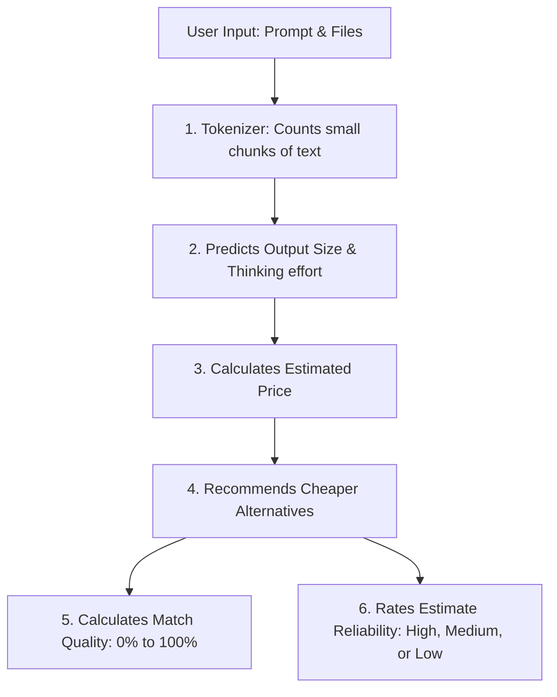

# TokenOptimizer

TokenOptimizer is a full-stack web application for estimating LLM usage cost before running a prompt. It helps builders understand prompt size, attachment token impact, output-token risk, reasoning-mode overhead, and cheaper model or prompt alternatives before spending credits.

The app is built as a monorepo with a React frontend and an Express backend. The frontend counts prompt and attachment input tokens locally. The backend fetches the broad live OpenRouter model catalog with `output_modalities=all`, avoids stale catalog caching, and performs backend-native estimation with deterministic fallback, so the app remains usable even when optional OpenRouter estimator calls are unavailable.

TokenOptimizer is an estimator and decision-support tool. It does not guarantee exact provider billing. The default path is a fast instant estimate. Users can also run an optional quality sweep by entering their OpenRouter API key at action time. The key is used only for that sweep request and is not stored by TokenOptimizer. The sweep executes the selected baseline and a small set of recommended alternatives through OpenRouter, then compares quality retention, cost, and latency. That sweep may consume OpenRouter credits.

## What It Does

- Counts prompt tokens locally with `tiktoken`.
- Estimates attachment token impact locally without uploading file bytes.
- Loads a refreshable OpenRouter model catalog with names, modality metadata, richer pricing, provider limits, and timestamps.
- Infers likely output type from the prompt instead of requiring a manual goal selector.
- Accepts an optional free-text reasoning mode such as `Fast`, `Pro`, `Thinking`, `Adaptive Thinking`, or `budget_tokens=2048`.
- Estimates visible output tokens, reasoning/thinking token overhead, total billable output tokens, and total cost.
- Shows context window usage: tokens used (input + estimated output), total context capacity, and a color-coded percentage (green for comfortable, yellow for moderate, red for near the limit).
- Ranks model and reasoning-mode alternatives by Match Quality, with cost savings shown separately.
- Runs an optional request-key quality sweep to measure whether candidate models preserve baseline output quality.
- Produces optimized prompt variants with token and cost deltas.

## Product Documentation

- [TOKENOPTIMIZER_PRD.md](./TOKENOPTIMIZER_PRD.md): full product requirements document covering problem, solution, model architecture, prompts, guardrails, evals, success metrics, GTM, and monetization options.
- [PRODUCT_ONE_PAGER.md](./PRODUCT_ONE_PAGER.md): concise product brief for quick review.
- [Render_deployment.md](./Render_deployment.md): step-by-step Render deployment guide.

## Tech Stack

Frontend:

- React
- Vite
- Tailwind CSS
- lucide-react
- tiktoken
- pdfjs-dist

Backend:

- Node.js
- Express
- node-fetch
- cors
- dotenv

External services:

- OpenRouter public model catalog with broad output modality coverage
- Optional OpenRouter estimator call from the backend
- Optional OpenRouter quality sweep and judge calls from the backend

## Project Structure

```text
token-optimizer/
  frontend/
    src/
    package.json
    vite.config.js
    tailwind.config.js
    .env.example
  backend/
    src/
    server.js
    package.json
    .env.example
  n8n/
    TokenOptimizer Workflow.json
  PRODUCT_ONE_PAGER.md
  TOKENOPTIMIZER_PRD.md
  Render_deployment.md
  README.md
```

The `n8n/` folder is retained as a legacy reference template. The main app no longer requires n8n to run.

## Prerequisites

- Node.js 18 or newer
- npm
- Git
- Optional: an OpenRouter API key if you want authenticated catalog requests and backend estimator refinement. Quality Sweep can also use a key entered in the browser for one request only.

Recommended local ports:

- Frontend: `http://localhost:5173`
- Backend: `http://localhost:3000`

## Environment Variables

Sensitive values are intentionally configured outside committed source code. Do not commit `.env` files, OpenRouter API keys, access tokens, logs, `node_modules`, or build output.

Create your backend environment file:

```bash
cd token-optimizer/backend
cp .env.example .env
```

On Windows PowerShell:

```powershell
cd token-optimizer/backend
Copy-Item .env.example .env
```

Backend `.env`:

```env
PORT=3000
CLIENT_ORIGIN=http://localhost:5173
OPENROUTER_API_KEY=
OPENROUTER_ESTIMATOR_MODEL=openrouter/free
OPENROUTER_TIMEOUT_MS=25000
OPENROUTER_BASELINE_MEASUREMENT_ENABLED=false
OPENROUTER_SWEEP_JUDGE_MODEL=openrouter/free
OPENROUTER_SWEEP_MAX_TOKENS=1200
```

Variable notes:

- `PORT`: backend port.
- `CLIENT_ORIGIN`: comma-separated allowed frontend origins for CORS.
- `OPENROUTER_API_KEY`: optional. When present, the backend can call OpenRouter for structured estimation, authenticated model catalog requests, and admin/local sweep fallback. Normal users can instead enter an OpenRouter key only when running Quality Sweep.
- `OPENROUTER_ESTIMATOR_MODEL`: optional estimator model. Defaults to `openrouter/free`.
- `OPENROUTER_TIMEOUT_MS`: timeout for optional estimator calls.
- `OPENROUTER_BASELINE_MEASUREMENT_ENABLED`: optional legacy estimate-path flag. Keep `false` unless you intentionally want `/api/analyze` to run the selected model for a measured baseline.
- `OPENROUTER_SWEEP_JUDGE_MODEL`: optional judge model for `/api/sweep`. Defaults to the estimator model or `openrouter/free`.
- `OPENROUTER_SWEEP_MAX_TOKENS`: maximum completion tokens per model run in a quality sweep. Lower values reduce cost but can truncate long outputs.

Create your frontend environment file only if you want to override the default backend URL:

```bash
cd token-optimizer/frontend
cp .env.example .env
```

Frontend `.env`:

```env
VITE_API_BASE_URL=http://localhost:3000
```

The frontend never needs API keys.

## Installation

Install backend dependencies:

```bash
cd token-optimizer/backend
npm install
```

Install frontend dependencies:

```bash
cd token-optimizer/frontend
npm install
```

## Running Locally

Start the backend:

```bash
cd token-optimizer/backend
npm run dev
```

Start the frontend in a second terminal:

```bash
cd token-optimizer/frontend
npm run dev
```

Open:

```text
http://localhost:5173
```

## API Overview

### `GET /api/health`

Returns:

```json
{ "status": "ok" }
```

### `GET /api/models`

Returns OpenRouter catalog data normalized for the frontend. The backend requests the broad OpenRouter catalog with `output_modalities=all` and responds with `Cache-Control: no-store` so browsers and proxies do not reuse stale catalog data.

```json
{
  "data": [
    {
      "id": "openai/gpt-4o-mini",
      "name": "OpenAI: GPT-4o-mini",
      "canonical_slug": "openai/gpt-4o-mini",
      "created": 1715367049,
      "description": "A compact multimodal OpenAI model...",
      "input_price": 0.0015,
      "output_price": 0.002,
      "pricing": {
        "prompt": 0.0000015,
        "completion": 0.000002,
        "request": null,
        "image": null,
        "internal_reasoning": null,
        "input_cache_read": null,
        "input_cache_write": null
      },
      "input_modalities": ["text"],
      "output_modalities": ["text"],
      "context_length": 128000,
      "supported_parameters": ["temperature", "max_tokens"],
      "default_parameters": null,
      "top_provider": {
        "context_length": 128000,
        "max_completion_tokens": 16384,
        "is_moderated": true
      },
      "expiration_date": null
    }
  ],
  "refreshed_at": "2026-05-14T10:30:00.000Z"
}
```

## Model Catalog Freshness

OpenRouter remains the source of truth for model availability, pricing, context limits, modalities, and provider metadata. TokenOptimizer does not use a local hardcoded model list.

- The frontend loads the catalog on app start.
- Users can click `Refresh` beside the model selector instead of reloading the page.
- The frontend refreshes the catalog in the background every 10 minutes while the page is open.
- The model selector shows `Last refreshed` so users know how fresh the catalog is.
- If a refresh fails, the app keeps the last successful in-memory catalog and shows a warning instead of clearing the model list.
- Newly launched models can appear only after OpenRouter exposes them through its API.

### `POST /api/analyze`

Required payload fields:

```json
{
  "prompt": "Create a concise app plan...",
  "model": "openai/gpt-4o-mini",
  "input_tokens": 120,
  "prompt_tokens": 120,
  "attachment_tokens": 0,
  "input_attachments": [],
  "input_price": 0.0015,
  "output_price": 0.002
}
```

Optional field:

```json
{
  "reasoning_mode": "Pro"
}
```

Success response keeps the stable contract:

```json
{
  "input_tokens": 120,
  "predicted_output": 900,
  "estimated_cost": 0.00198,
  "optimization_tip": "..."
}
```

Additional optional fields may include:

- `output_type`
- `artifact_type`
- `visible_output_tokens`
- `reasoning_token_estimate`
- `reasoning_mode_label`
- `recommended_reasoning_mode`
- `reasoning_mode_rationale`
- `mode_cost_delta`
- `optimization_recommendations`
- `overall_rank_score`
- `rank_score_breakdown`

### `POST /api/sweep`

Runs the selected model and up to three recommended alternatives through OpenRouter, then judges candidate output against a blinded selected-model baseline. This endpoint requires either `openrouter_api_key` in the request body or the optional backend `OPENROUTER_API_KEY` fallback. It may consume credits from the provided key.

Payload is the same as `/api/analyze`, with optional controls:

```json
{
  "openrouter_api_key": "<request-scoped-openrouter-key>",
  "max_candidates": 3,
  "trials": 1
}
```

`openrouter_api_key` is request-scoped. The frontend keeps it in memory only, sends it only to `/api/sweep`, and clears it after the request finishes. TokenOptimizer does not store or return the key.

The response includes the normal estimate fields plus:

- `sweep_result.credential_source`: `request_key` or `environment_key`.
- `sweep_result.credit_required`: `true`.
- `sweep_result.measurement_source`: `openrouter`.
- `sweep_result.baseline`: measured selected-model usage, cost, latency, finish reason, and output preview.
- `sweep_result.candidates`: measured candidate usage, quality retention, savings, cost per accepted answer, latency, and judge rationale.
- `sweep_result.recommendation`: best measured quality-preserving substitute.
- `sweep_result.audit`: inferred task/output rubric and any warnings, such as attachment-only metadata limits.

## Reasoning Mode Input

The reasoning mode textbox is optional estimation metadata. It does not guarantee a provider execution setting; it helps TokenOptimizer estimate how much extra thinking or reasoning overhead a prompt may incur.

Examples:

- `Fast`
- `low`
- `Balanced`
- `Thinking`
- `Adaptive Thinking`
- `Pro`
- `high`
- `budget_tokens=2048`

If left empty, the backend uses `Standard` mode. This avoids silently upgrading the user into a higher-cost thinking mode unless they explicitly ask for it.

## How The Estimate Works

TokenOptimizer separates the estimate into plain-language parts:

- `Prompt + file tokens`: input size counted or estimated locally.
- `Estimated Output Tokens`: the answer size the user is likely to see.
- `Thinking mode cost`: estimated extra reasoning tokens from modes such as Thinking, Pro, or custom token budgets.
- `Total output tokens`: estimated answer tokens plus thinking tokens.
- `Estimated price`: input cost plus output cost using the selected model prices.

For text-like outputs, the plain-English formula is:

```text
Estimated Price = (Text sent × input price) + (Estimated answer length × output price)
```
Prices are calculated per 1,000 tokens (which are just small chunks of text, roughly 3/4 of a word).

For image, audio, and video-style outputs, TokenOptimizer uses the input-token cost plus a modality-aware output estimate rather than pretending every output behaves like normal text.

Here is a visual overview of how the estimation workflow works for a non-technical user:



## How Recommendation Match Quality Works

Recommendations are not sorted by cheapest price alone. TokenOptimizer uses a score called **Match Quality** (from 0% to 100%). It answers:

> If I switch from my selected model and reasoning mode to this recommended model and mode, how likely is it that useful output quality will be preserved without losing important details?

To make this easy for non-technical users to understand, the dashboard's calculation explainer displays these as simple predictability ratings (**High reliability**, **Medium reliability**, or **Low reliability**) along with the percentage, hiding complex math formulas and internal system heuristics.

The selected model is treated as the baseline. By default this baseline is estimated by the backend. If you deliberately enable `OPENROUTER_BASELINE_MEASUREMENT_ENABLED=true`, the backend can run the selected model through OpenRouter and use response usage metadata as the baseline. That option may consume OpenRouter credits and is disabled by default.

| Factor | Max Points | Sub-score breakdown |
| --- | ---: | --- |
| Capability match | 30 | Baseline tier proximity `10`, model capacity `7`, family signal `4`, specialization `5`, downgrade safety `4`. Family credit is intentionally small so familiar model names do not dominate the score. |
| Task and output fit | 20 | Modality/artifact match `7`, task pattern match `5`, complexity handling `5`, format/constraint fit `3`. |
| Reasoning-mode equivalence | 20 | Mode match `7`, reasoning support `5`, prompt complexity adequacy `5`, cheaper-mode safety `3`. |
| Context and attachment safety | 15 | Context occupancy `7`, attachment room `4`, output/reasoning headroom `2`, metadata certainty `2`. |
| Reliability and metadata confidence | 10 | Complete metadata `3`, stable route `3`, pricing/parameter clarity `2`, non-expired/non-deprecated signal `2`. |
| Cost-risk adjustment | 5 | Meaningful savings `2`, savings not caused by a severe downgrade `2`, attachment-safe cost math `1`. |

Score bands:

- `90-100%`: very likely equivalent (Excellent Match Quality)
- `80-89%`: strong alternative (Good Match Quality)
- `70-79%`: reasonable tradeoff (Fair Match Quality)
- `55-69%`: risky but possibly acceptable (Low Match Quality)
- `<55%`: not recommended for quality-sensitive use (Poor Match Quality)

Cost savings are shown as a separate badge and only affect confidence through the small cost-risk adjustment. Attachment tokens remain part of all recommendation math. If an optimized prompt reduces prompt text, TokenOptimizer compares `optimized prompt tokens + unchanged attachment tokens` against `original prompt tokens + attachment tokens`.

The scorer also applies guardrails after raw scoring. Known model family signals cannot add more than `4` capability points, weak task/context fit caps confidence, modality mismatch caps confidence at `55`, risky context usage caps confidence at `70` or `55`, missing pricing/context metadata caps confidence at `80`, and premium-to-light or high-reasoning downgrades are capped for complex prompts. These caps keep recommendations from ranking highly just because they are cheap or belong to a familiar model family.

## How Quality Sweep Works

The quality sweep is the evidence-backed path inspired by eval-first model selection workflows:

1. Use the request-scoped OpenRouter key, or the optional backend fallback key, to run the selected model and reasoning mode as the baseline through OpenRouter.
2. Use the current recommendation engine to shortlist up to three candidate model/mode combinations.
3. Run candidates through OpenRouter with the same prompt and attachment metadata.
4. Judge anonymized baseline and candidate answers with a dimension rubric: instruction following, completeness, task-specific quality, structure/format, factual grounding, and brevity.
5. Rank candidates by measured quality retention first, then cost per accepted answer, then latency.

Quality sweep results show measured quality retention for that run compared to the baseline. The UI displays this comparison directly: *"Best Result: [Model Name] kept [X%] of the original quality while saving [Y%] compared to the original model."* The UI labels the difference so users do not confuse a pre-flight heuristic estimate with a measured comparative test. Users should create a limited OpenRouter key for TokenOptimizer, set OpenRouter-side usage limits where available, and rotate/delete the key if they no longer need sweeps.

## Attachment Estimation

Attachments stay local in the browser. The frontend sends only metadata and token estimates to the backend.

- Text-like files are counted from local text extraction.
- PDFs use local text extraction when available.
- Scanned PDFs use page-count fallback.
- Images use dimensions and a tile estimate.
- Other file types use a low-confidence size-based estimate.

## Production Deployment

The recommended free-friendly deployment path is Render:

- Render Static Site for the frontend.
- Render Web Service for the backend.
- OpenRouter key stored only in backend environment variables if authenticated catalog requests or estimator calls are enabled. Quality Sweep can use a temporary user-provided key instead of backend storage.

See [Render_deployment.md](./Render_deployment.md) for the full deployment guide.

## Legacy n8n Workflow

`n8n/TokenOptimizer Workflow.json` is retained as a legacy import template from earlier versions of the project. It should not contain private workflow IDs, webhook IDs, credential IDs, API keys, or private webhook URLs.

The current app does not require n8n. Do not configure `N8N_WEBHOOK_URL` for the main backend unless you are experimenting with the legacy workflow yourself.

## Security Notes

- Never expose API keys in the frontend.
- Do not commit `.env` files.
- Do not commit OpenRouter keys, authorization tokens, private webhook URLs, logs, `node_modules`, or `dist`.
- Backend CORS should include only trusted frontend origins.
- File bytes and extracted attachment text are not sent to the backend.

## Useful Commands

Frontend build:

```bash
cd token-optimizer/frontend
npm run build
```

Backend start:

```bash
cd token-optimizer/backend
npm run start
```

Backend syntax check:

```bash
cd token-optimizer/backend
node --check server.js
```
