# TokenOptimizer PRD

Version: 1.0  
Date: May 11, 2026  
Author / Role: Saurabh Patil - Product Builder  
Status: MVP / In Progress  

## One-Line Product Statement

TokenOptimizer helps users estimate LLM prompt cost before execution by showing prompt size, file impact, likely output tokens, reasoning-mode overhead, model pricing, and cheaper prompt/model alternatives.

## Table Of Contents

1. Executive Summary
2. The Current Problem
3. Why This Problem Matters
4. Target Users And Personas
5. Solution Overview
6. Current MVP Scope
7. User Journey
8. Feature List
9. Model Architecture
10. System Prompts And Estimation Logic
11. Guardrails
12. Evals
13. Success Metrics
14. Risks And Mitigations
15. Go-To-Market And Validation
16. Monetization Options
17. Out Of Scope
18. Open Questions
19. Appendix

---

## 1. Executive Summary

TokenOptimizer is a full-stack web application that helps people estimate LLM usage cost before running a prompt. The product is built for users who work with AI models frequently and want to understand the cost impact of their prompt, files, model choice, and optional reasoning mode before they spend credits.

The current MVP is a web application with a React frontend and an Express backend. The frontend counts prompt tokens locally and estimates attachment token impact without uploading file contents. The backend pulls live model pricing from OpenRouter, infers the likely output type from the prompt, estimates expected output size, adds reasoning-mode overhead, calculates price, and recommends cheaper model or prompt alternatives.

The product solves a practical problem: most users do not know how expensive a prompt may become until after it is executed. This is especially painful when prompts are long, files are attached, expensive models are selected, or reasoning modes like Pro, Thinking, Adaptive Thinking, or custom token budgets are used.

TokenOptimizer acts as a pre-flight decision layer. Before running a prompt, a user can ask:

- How large is my input?
- How expensive might the answer be?
- Is this model too expensive for the task?
- Would a cheaper model or reasoning mode be enough?
- How can I rewrite the prompt to reduce cost while keeping quality?

The current product is not a billing system and does not guarantee exact provider charges. It is an estimator and decision-support tool. Its value is to make LLM cost visible before execution so users can make better model, mode, and prompt choices.

---

## 2. The Current Problem

LLM usage feels simple from the outside: type a prompt, select a model, and get an answer. Under the hood, the cost can change significantly based on several hidden variables.

### Problem 1: Users do not know prompt cost before execution

Most AI tools show the output after the request is complete, but they do not always make cost visible before the request is sent. Users often discover cost only after credits are consumed.

This creates a blind spot. A user may write a long prompt, attach files, choose a premium model, enable a reasoning mode, and only later realize the run was more expensive than expected.

### Problem 2: Model selection is difficult

OpenRouter and similar model providers expose many models with different prices, strengths, context lengths, and modality support. A non-technical user may not know whether a premium model is required or whether a cheaper model is good enough.

For example, a user may choose a high-end model for a simple formatting task. The task may not need deep reasoning, but the user has no simple way to compare cost before running it.

### Problem 3: Files make cost harder to understand

When users attach PDFs, text files, images, or other file types, the input size increases. A large PDF or image can make the request more expensive even before the model generates an answer.

Most users do not think in tokens. They think in file size, page count, and prompt length. TokenOptimizer translates these inputs into estimated token impact.

### Problem 4: Reasoning modes are confusing

Modern models increasingly support thinking or reasoning modes. Different providers use different names, such as Fast, Pro, Thinking, Adaptive Thinking, low, medium, high, or explicit token budgets.

These modes can improve quality for complex tasks, but they may also increase billed output tokens. Users need a simple way to understand when a deeper mode is useful and when a cheaper mode is enough.

### Problem 5: Prompt optimization is disconnected from cost

Users often rewrite prompts for quality, but not for cost. A good prompt should be clear and useful, but it should also avoid repeated context, unnecessary instructions, and vague output requirements that create longer responses than needed.

TokenOptimizer connects prompt quality with cost awareness.

---

## 3. Why This Problem Matters

AI usage is moving from occasional experiments to everyday work. Teams now use LLMs for research, product planning, code generation, customer support, documents, images, audio, and workflows. As usage grows, small model and prompt decisions can create meaningful cost differences.

### Surprise spend

Without pre-flight estimation, users may accidentally spend more than expected. This is more likely when they use premium models, long prompts, large files, or reasoning modes.

### Poor model selection

Users often select the most powerful model because it feels safest. This is understandable, but it may be wasteful for simple tasks. Many prompts can be handled by cheaper models with acceptable quality.

### Inefficient prompt writing

Long prompts are not always better prompts. Repeated context, unclear output format, and unnecessary background can increase input size and output length. This can raise cost without improving quality.

### Lack of reasoning-mode awareness

Reasoning modes can be valuable for deep analysis, complex tradeoffs, and high-stakes reasoning. But not every task needs high reasoning overhead. A simple summary, format conversion, or first draft may work well with a standard or fast mode.

### Scaling team usage

For an individual, a few extra cents may not matter. For a team running hundreds or thousands of prompts, the same inefficiency can become a real operating cost. Teams need a simple way to teach better prompt and model decisions before expensive habits scale.

---

## 4. Target Users And Personas

TokenOptimizer is useful for anyone who works with LLMs often enough to care about cost, model choice, and prompt quality.

### Persona 1: Individual AI Power User

| Attribute | Description |
| --- | --- |
| Name | Riya, AI-heavy knowledge worker |
| Context | Uses ChatGPT, Claude, Gemini, and OpenRouter for research, writing, planning, and analysis. |
| Goal | Get good output without wasting credits or overusing premium models. |
| Pain Point | Does not know whether a prompt is too long or whether a cheaper model is enough. |
| Current Workaround | Uses intuition, trial and error, or default model choices. |
| JTBD | When I am about to run a detailed prompt, help me understand the likely cost and suggest a cheaper option if quality will remain acceptable. |

### Persona 2: Product Or Engineering Builder

| Attribute | Description |
| --- | --- |
| Name | Arjun, product builder working on AI workflows |
| Context | Builds apps, agents, and internal tools that call LLMs repeatedly. |
| Goal | Choose the right model and prompt structure before building expensive workflows. |
| Pain Point | Cost estimates are unclear until after test runs. |
| Current Workaround | Runs manual tests across models and checks usage after the fact. |
| JTBD | When I am designing an AI workflow, help me estimate model cost early so I can choose a sustainable architecture. |

### Persona 3: Startup Operator Managing AI Costs

| Attribute | Description |
| --- | --- |
| Name | Meera, founder or operator at an AI-enabled startup |
| Context | Uses LLMs for internal productivity and product features. |
| Goal | Keep experimentation fast without losing control over API spend. |
| Pain Point | Team members choose expensive models by default. |
| Current Workaround | Sets rough budgets or asks users to be careful. |
| JTBD | When the team uses LLMs, help us compare cheaper model choices and avoid unnecessary premium usage. |

### Persona 4: Team Lead Reviewing Model Usage

| Attribute | Description |
| --- | --- |
| Name | Dev, engineering or product lead |
| Context | Reviews AI workflows, prototypes, and model choices across a team. |
| Goal | Make sure model choices match business value and task complexity. |
| Pain Point | Hard to explain why one model or reasoning mode is more cost-effective than another. |
| Current Workaround | Relies on ad hoc judgment and scattered model pricing pages. |
| JTBD | When reviewing an AI workflow, help me explain the cost-quality tradeoff in simple terms. |

---

## 5. Solution Overview

TokenOptimizer is a pre-flight cost estimator for LLM work.

The user brings the prompt they plan to run. The product analyzes the prompt, any local attachment metadata, selected model pricing, and optional reasoning mode. It then returns an estimate of input size, likely output size, thinking-mode overhead, total output tokens, estimated price, and recommendations.

### Core product promise

Before spending model credits, the user should know:

1. How large the prompt and files are.
2. What kind of output the prompt is likely asking for.
3. How many answer tokens the model may produce.
4. Whether a reasoning mode may add extra billed tokens.
5. What the selected model may cost.
6. Which cheaper model or mode may be good enough.
7. How the prompt could be rewritten to reduce cost or improve clarity.

### What the product does today

| Step | What happens |
| --- | --- |
| User writes prompt | Frontend counts prompt tokens locally with `tiktoken`. |
| User adds files | Frontend estimates file token impact locally; file bytes do not go to backend. |
| User selects model | Frontend loads live OpenRouter model catalog and pricing. |
| User enters reasoning mode | Backend interprets the text as Fast, Standard, Thinking, Pro, or custom budget. |
| User clicks Estimate cost | Backend infers output type, estimates answer size, adds reasoning overhead, and calculates cost. |
| User reviews result | Dashboard shows cost, tokens, recommendations, and optimized prompt suggestions. |

### What the product does not do today

TokenOptimizer does not run the selected model and does not guarantee exact billing. It estimates cost before execution. Exact measurement may be added later, but the current MVP is intentionally focused on pre-flight decision support.

---

## 6. Current MVP Scope

The current MVP is a deployable web application.

### In scope

| Area | Current capability |
| --- | --- |
| Frontend | React, Vite, Tailwind CSS, lucide-react UI. |
| Backend | Node.js and Express API. |
| Model catalog | Fetches live OpenRouter model metadata and pricing. |
| Prompt tokens | Counts prompt tokens locally in the browser. |
| Attachments | Estimates token impact locally for text, PDF, image, audio, video, and generic files. |
| File privacy | Sends only file metadata and token estimates to backend, not file bytes. |
| Output inference | Infers Text, File, Image, Audio, or Video from prompt language and attachment metadata. |
| Artifact inference | Identifies broad artifact type such as Chat, Report, App, Website, Agent, MCP, Image, Audio, Video, or General. |
| Reasoning mode | Optional textbox accepts values like Fast, Pro, Thinking, Adaptive Thinking, high, low, or budget tokens. |
| Cost estimate | Calculates input cost plus estimated output cost. |
| Recommendations | Suggests cheaper model, reasoning mode, and prompt improvements. |
| Optimized prompts | Produces model-aware optimized prompt suggestions. |
| Deployment | Supports Render frontend and backend deployment. |

### Legacy reference

The repository still contains an `n8n/` folder as a sanitized legacy workflow template. It is not required for the current application runtime.

The current backend has moved the core estimation logic into Express services. This makes the app easier to host, easier to debug, and less dependent on an expiring external workflow tool.

### Not in current MVP

- User accounts
- Prompt history
- Team dashboards
- Exact OpenRouter generation measurement
- Chrome extension
- Browser-injected prompt assistant
- Billing system
- Admin controls
- Full observability platform

---

## 7. User Journey

### Journey: First-time user

1. User opens TokenOptimizer.
2. User lands on the About page.
3. User reads what the product does and why it matters.
4. User clicks into the Optimizer workspace.
5. User pastes a prompt.
6. User optionally attaches files.
7. User selects a model from the OpenRouter catalog.
8. User optionally enters a reasoning mode.
9. User clicks `Estimate cost`.
10. User reviews cost, token breakdown, model recommendations, and optimized prompt.
11. User copies the optimized prompt or uses the cheaper model/mode suggestion outside the product.

### Journey: Returning user

1. User opens the Optimizer directly.
2. User pastes a working prompt.
3. User selects the model they were planning to use.
4. User enters a known reasoning mode if relevant.
5. User estimates cost.
6. User checks whether the selected model is worth the price.
7. User copies the optimized prompt or changes the model before running the real request.

### Journey: User with file-heavy prompt

1. User pastes the prompt.
2. User attaches a PDF, text file, image, or other file.
3. Browser estimates token impact locally.
4. Dashboard shows prompt plus file token size.
5. Backend estimates likely output and total price.
6. User sees whether the file significantly changes expected cost.

### Journey: User testing reasoning modes

1. User writes a complex prompt.
2. User selects a premium model.
3. User enters `Pro`, `Thinking`, or `budget_tokens=2048`.
4. TokenOptimizer estimates extra thinking tokens.
5. Product recommends whether Standard or Fast mode may be enough.
6. User decides whether the deeper mode is worth the cost.

---

## 8. Feature List

| Feature | Description | User Value |
| --- | --- | --- |
| Prompt token counter | Counts prompt tokens locally after a short debounce. | Helps users understand input size before analysis. |
| Attachment estimator | Estimates local file token impact from metadata, extracted text, dimensions, or file size. | Helps users understand cost impact of files without uploading them. |
| Model search | Searches live OpenRouter catalog by model name or ID. | Helps users quickly select a model without scrolling through a long list. |
| Price chips | Shows input and output price per 1K tokens for the selected model. | Makes pricing visible at the moment of model selection. |
| Reasoning mode textbox | Lets users type optional mode hints like Fast, Pro, Thinking, or token budgets. | Helps estimate hidden thinking-mode overhead. |
| Backend prompt inference | Reads prompt language and infers output modality and artifact type. | Removes need for users to manually choose output goal. |
| Cost estimate dashboard | Shows prompt/file tokens, estimated output tokens, thinking-mode tokens, total output tokens, and price. | Gives a clear pre-flight cost view. |
| Recommendations | Suggests cheaper model/mode alternatives. | Helps reduce cost without making users search manually. |
| Optimized prompt | Generates a ready-to-use prompt tailored to the recommended model and output type. | Helps improve prompt quality and cost efficiency. |
| Calculation explainer | Explains how the estimate was calculated. | Builds user trust and makes the numbers easier to understand. |
| Secure backend handling | Keeps API keys on backend only. | Prevents frontend exposure of sensitive credentials. |
| Deterministic fallback | Uses local backend logic if OpenRouter estimator call is unavailable. | Keeps app usable even when optional model calls fail. |

---

## 9. Model Architecture

TokenOptimizer has three main layers:

1. Frontend local analysis layer
2. Backend estimation and recommendation layer
3. External model catalog and optional estimator layer

### Architecture diagram

```mermaid
flowchart TD
    A["User enters prompt"] --> B["React frontend"]
    C["User attaches files"] --> B
    B --> D["Local token counting"]
    B --> E["Local attachment estimation"]
    B --> F["Model selector"]
    F --> G["GET /api/models"]
    G --> H["Express backend"]
    H --> I["OpenRouter model catalog"]
    B --> J["POST /api/analyze"]
    J --> K["Request validation"]
    K --> L["Prompt inference service"]
    K --> M["Reasoning mode service"]
    L --> N["Backend estimator service"]
    M --> N
    N --> O{"OpenRouter estimator key configured?"}
    O -->|"Yes"| P["Optional OpenRouter estimator call"]
    O -->|"No or failed"| Q["Deterministic fallback estimate"]
    P --> R["Clamp and normalize estimate"]
    Q --> R
    R --> S["Optimization recommendation service"]
    S --> T["Dashboard response"]
    T --> B
```



### Frontend local estimation layer

The frontend is responsible for fast, private, local calculations.

It handles:

- Prompt input
- Token counting with `tiktoken`
- File selection
- Attachment token estimation
- Model search UI
- Reasoning mode text input
- API request construction
- Dashboard rendering

The frontend does not receive API keys. It also does not upload file bytes to the backend. For attachments, it sends only metadata such as file type, name, size, page count, dimensions, token estimate, confidence, and estimation method.

### Backend API layer

The backend is the trusted server-side layer. It receives the analysis payload and performs:

- Request validation
- Prompt output inference
- Reasoning mode classification
- Optional OpenRouter estimator call
- Deterministic fallback estimation
- Cost calculation
- Recommendation generation
- API response normalization

### OpenRouter catalog layer

The `/api/models` endpoint calls the public OpenRouter model catalog. It normalizes each model into a structure the frontend can use:

- `id`
- `name`
- `input_price`
- `output_price`
- `input_modalities`
- `output_modalities`
- `context_length`

This allows users to search live model options and see current pricing without hardcoded model lists.

### Prompt inference service

The backend reads the prompt and estimates what kind of output the user likely wants.

Possible output types:

- Text
- File
- Image
- Audio
- Video

Possible artifact types:

- Chat
- Report
- App
- Website
- Agent
- MCP
- Image
- Audio
- Video
- General

The inference logic uses prompt language. For example:

- Words like `report`, `document`, `comparison table`, `citations`, or `resources with links` suggest a File or Report output.
- Words like `image`, `photo`, `illustration`, `render`, or `8k` suggest Image.
- Words like `audio`, `narration`, `podcast`, or `speech` suggest Audio.
- Words like `video`, `scene`, `camera movement`, or `animation` suggest Video.
- Words like `build`, `design`, `implement`, `app`, or `dashboard` can suggest App when the prompt is asking for an actual product or software plan.

### Reasoning mode service

The reasoning mode service reads optional user text and maps it to a cost bucket.

| User input examples | Bucket | Meaning |
| --- | --- | --- |
| `fast`, `low`, `flash`, `lite` | Fast | Low reasoning overhead. |
| blank, `standard`, `default`, `balanced` | Standard | Normal reasoning overhead. |
| `thinking`, `reasoning`, `adaptive` | Adaptive Thinking | Higher reasoning overhead. |
| `pro`, `deep`, `high`, `xhigh`, `extended` | Pro | High reasoning overhead. |
| `budget_tokens=2048`, `2048 tokens` | Custom | Uses explicit token budget. |

If the input is blank, the current behavior treats it as Standard. This keeps the product from automatically upgrading the user into expensive thinking modes without their explicit input.

### Estimator service

The estimator service combines local inference and optional AI estimation.

It calculates:

- Prompt and file input tokens
- Estimated user-visible answer tokens
- Reasoning or thinking token overhead
- Total billable output tokens
- Estimated price
- Prediction range and confidence notes

For text-like outputs, it uses:

```text
Estimated price =
input tokens x input price / 1,000
+ total output tokens x output price / 1,000
```

For media-like outputs, it uses the input cost plus a flat/unit-style estimate because image, audio, and video outputs are not always billed like normal text tokens.

### Optimization recommendation service

The recommendation service compares candidate models from the loaded catalog. It estimates cost using the same token profile and returns the top alternatives.

Each recommendation can include:

- Model name and ID
- Estimated cost
- Savings percent
- Confidence score
- Suggested reasoning mode
- Prompt strategy
- Optimized prompt
- Token delta
- Cost delta
- Changes made

---

## 10. System Prompts And Estimation Logic

TokenOptimizer has two estimation paths:

1. Deterministic backend estimate
2. Optional OpenRouter estimator refinement

The deterministic estimate is always available. The optional OpenRouter estimator is used only when an OpenRouter API key is configured on the backend.

### Deterministic backend estimate

The deterministic estimate is not an LLM call. It is code-based logic that uses:

- Prompt length
- Prompt words
- Structured labels like Role, Context, Task, Format, Constraints
- Keywords that suggest output type
- Attachment token estimates
- Prompt complexity
- Artifact type
- Selected model prices
- Reasoning mode bucket

This fallback is important because the product should not fail if OpenRouter is unavailable, rate limited, or payment blocked.

### Optional OpenRouter estimator prompt

When configured, the backend sends a small structured estimator request to OpenRouter. This request does not run the user's selected model for final output. It asks a low-cost estimator model to help refine the output estimate.

The system prompt used by the estimator is:

```text
You are TokenOptimizer's estimation engine. Return only minified JSON with keys visible_output_tokens, output_type, artifact_type, prediction_confidence, optimization_tip, prediction_notes. Estimate the likely visible model output size and artifact modality. Do not include markdown.
```

The user message sent to the estimator contains structured metadata:

```json
{
  "prompt": "User prompt",
  "selected_model": "Selected model ID",
  "input_tokens": 1200,
  "prompt_tokens": 900,
  "attachment_tokens": 300,
  "input_attachments": [
    {
      "type": "document",
      "name": "example.pdf",
      "mime_type": "application/pdf",
      "token_estimate": 300,
      "confidence": "medium",
      "method": "pdf text extraction"
    }
  ],
  "local_inference": {
    "output_type": "File",
    "artifact_type": "Report",
    "complexity": "high",
    "visible_output_tokens": 3200
  },
  "reasoning_mode": {
    "input": "Pro",
    "interpreted_mode": "Pro",
    "estimated_reasoning_tokens": 1440
  }
}
```

The estimator must return only JSON:

```json
{
  "visible_output_tokens": 3000,
  "output_type": "File",
  "artifact_type": "Report",
  "prediction_confidence": 0.78,
  "optimization_tip": "Use a tighter report outline and keep citation requirements explicit.",
  "prediction_notes": "The prompt asks for a structured report with comparison tables and references."
}
```

### Why the estimator is advisory

The estimator does not fully control the final result. The backend clamps and normalizes its output against the deterministic estimate. This prevents the estimator from returning unrealistic values like a 200-token output for a detailed report.

If the estimator fails, times out, returns malformed JSON, or is not configured, the deterministic estimate is used.

### Visible output tokens

Visible output tokens are the tokens in the answer the user expects to see.

Examples:

- A short answer may be 200 to 500 visible output tokens.
- A report may be 2,000 to 7,000 visible output tokens.
- An app plan may be 1,600 to 5,800 visible output tokens.
- Image, audio, and video outputs may show 0 visible text output tokens because the output is media, not a text answer.

In the UI, this is labeled as `Estimated Output Tokens`.

### Thinking mode cost

Some model modes may use extra internal thinking or reasoning tokens. These tokens may not always be shown to the user, but they can still increase cost.

TokenOptimizer estimates this separately so users can see the difference between:

- The answer they see
- The extra thinking tokens that may be billed
- The total output tokens used for cost estimation

### Total output tokens

Total output tokens are:

```text
Estimated answer tokens + estimated thinking tokens
```

For example:

| Item | Tokens |
| --- | ---: |
| Estimated answer tokens | 3,000 |
| Thinking mode tokens | 360 |
| Total output tokens | 3,360 |

### Estimated price

The main text cost formula is:

```text
Estimated price =
input tokens x input price / 1,000
+ total output tokens x output price / 1,000
```

Example:

| Field | Value |
| --- | ---: |
| Input tokens | 1,000 |
| Input price | $0.002 per 1K |
| Total output tokens | 3,000 |
| Output price | $0.012 per 1K |
| Estimated price | $0.038 |

Calculation:

```text
1,000 x 0.002 / 1,000 = 0.002
3,000 x 0.012 / 1,000 = 0.036
Total = 0.038
```

### Prompt optimization framework

The optimized prompt follows a simple human-readable structure:

| Part | Purpose |
| --- | --- |
| Role | Tells the model what expert lens to use. |
| Context | Gives only the background needed for the task. |
| Task | States exactly what the user wants. |
| Format | Defines the output structure. |
| Constraints | Lists rules, limits, and must-have requirements. |

The product tries to reduce repeated context and bring the most important instruction closer to the top.

---

## 11. Guardrails

TokenOptimizer uses product, technical, and security guardrails.

### Security guardrails

| Guardrail | Why it matters |
| --- | --- |
| API keys stay on backend | Prevents exposing OpenRouter keys in the browser. |
| `.env` files are ignored by Git | Prevents secrets from being committed. |
| Frontend does not need secrets | Keeps deployment safer and simpler. |
| CORS is restricted by `CLIENT_ORIGIN` | Only approved frontend origins can call the backend. |
| Render stores secrets as environment variables | Keeps production secrets outside GitHub. |

### File privacy guardrails

| Guardrail | Why it matters |
| --- | --- |
| File bytes stay local | User files are not uploaded for estimation. |
| Only metadata is sent | Backend receives token estimate, file type, size, and confidence only. |
| Extracted PDF/text content is not sent | Reduces privacy risk. |
| Generic files use low-confidence estimate | Product is honest when it cannot read file content. |

### Estimation guardrails

| Guardrail | Why it matters |
| --- | --- |
| OpenRouter estimator is optional | App still works without paid estimator calls. |
| Deterministic fallback always exists | Product does not fail when estimator is unavailable. |
| Estimator output is clamped | Prevents unrealistic output estimates. |
| Estimates are labeled as estimates | Avoids presenting projections as exact billing. |
| Blank reasoning mode defaults to Standard | Avoids silent upgrade to expensive reasoning modes. |

### Backend validation guardrails

The backend validates:

- Prompt is present
- Model is present
- Input tokens are valid
- Input price is valid
- Output price is valid
- Attachment metadata is well formed
- Candidate model list is capped

If invalid data is sent, the backend returns a clear error instead of trying to estimate from broken inputs.

---

## 12. Evals

TokenOptimizer should be evaluated in two ways:

1. Offline evals before deployment
2. Online evals after real user usage

### Golden dataset

The golden dataset should include common and edge-case prompts.

| Test Case | Example Prompt | Expected Behavior |
| --- | --- | --- |
| Short chat | "Explain token pricing in simple terms." | Output type Text, artifact Chat or General, low output estimate. |
| Report/file | "Create a document with headers, comparison table, sources, and references." | Output type File, artifact Report, larger output estimate. |
| Image | "Generate a cinematic image of a futuristic city skyline." | Output type Image, media-style cost estimate. |
| Website/app | "Create an app plan for a project management dashboard." | Output type Text, artifact App, planning-sized estimate. |
| High reasoning | "Evaluate tradeoffs across five architectures and recommend one." | Higher complexity, reasoning mode guidance. |
| Large attachment | Prompt with a 5MB file metadata estimate. | Input tokens increase, file breakdown shown. |
| Explicit budget | Reasoning mode `budget_tokens=2048`. | Reasoning token estimate uses 2048. |
| Fast mode | Reasoning mode `Fast`. | Lower thinking overhead. |
| Pro mode | Reasoning mode `Pro`. | Higher thinking overhead. |
| OpenRouter failure | Estimator unavailable. | Deterministic backend estimate still returns success. |

### Offline evals

| Eval | What It Checks | Pass Criteria |
| --- | --- | --- |
| Prompt inference accuracy | Whether output type and artifact type match prompt intent. | At least 80% correct on golden dataset. |
| Cost formula correctness | Whether estimated cost math is accurate. | 100% correct for deterministic examples. |
| Reasoning mode classification | Whether mode text maps to correct bucket. | Fast, Standard, Thinking, Pro, and custom budget all pass. |
| Attachment estimate sanity | Whether file metadata produces reasonable token estimates. | Estimates are non-negative and confidence is shown. |
| API schema validation | Whether `/api/analyze` returns required fields. | Always returns stable success shape on valid input. |
| Fallback reliability | Whether app works without OpenRouter estimator. | No valid request fails only because estimator is unavailable. |
| Recommendation sanity | Whether cheaper recommendations are sorted by cost and context length. | Top recommendations are cheaper or clearly explained. |

### Online evals

Online evals measure real usage behavior.

| Metric | What It Measures | Why It Matters |
| --- | --- | --- |
| Estimate completion rate | Users who complete an estimate after opening Optimizer. | Shows whether the workflow is usable. |
| Model catalog success rate | Successful `/api/models` loads. | Shows reliability of external catalog dependency. |
| Error rate | Failed analyze requests divided by total requests. | Tracks product health. |
| Optimized prompt copy rate | Users who copy or use optimized prompts. | Shows whether recommendations are useful. |
| Repeat usage | Users who return and estimate again. | Shows product stickiness. |
| Trust score | User feedback on whether estimate felt useful. | Measures confidence in the product. |

### Human review evals

Because this is a product for decision support, human review matters.

Reviewers should check:

- Does the explanation make sense to a non-technical user?
- Does the recommendation feel practical?
- Does the optimized prompt preserve the original task?
- Does the estimate feel directionally realistic?
- Does the app avoid overclaiming exact accuracy?

---

## 13. Success Metrics

### North Star Metric

| Metric | Definition | Target |
| --- | --- | --- |
| Useful estimates completed | Number of estimates where the user reaches a result and finds it useful enough to act on. | Validate with first 100 to 200 users. |

### Primary metrics

| Metric | Definition | Target |
| --- | --- | --- |
| First estimate completion | Users who run at least one estimate after landing. | 50%+ of users who open Optimizer. |
| Recommendation engagement | Users who view or copy optimized prompt/recommendation. | 25%+ of completed estimates. |
| Repeat usage | Users who return within 7 days. | 20%+ after first launch cohort. |
| Model catalog load success | Successful model catalog loads. | 95%+ in production. |

### Secondary metrics

| Metric | Definition | Target |
| --- | --- | --- |
| Average estimated savings | Difference between selected model cost and best recommended alternative. | Directionally positive. |
| Reasoning mode usage | Percentage of users entering optional reasoning mode. | Learn baseline behavior first. |
| Attachment usage | Percentage of estimates with files. | Understand file-heavy use cases. |
| Prompt optimization usage | Copies or uses of optimized prompt. | Track usefulness. |

### Guardrail metrics

| Metric | Healthy | At Risk | Critical |
| --- | ---: | ---: | ---: |
| Analyze API error rate | Under 5% | 5% to 12% | Over 12% |
| Model catalog timeout rate | Under 5% | 5% to 10% | Over 10% |
| OpenRouter estimator fallback rate | Under 40% | 40% to 70% | Over 70% |
| User confusion on calculation | Under 20% negative feedback | 20% to 40% | Over 40% |

---

## 14. Risks And Mitigations

| Risk | Impact | Likelihood | Mitigation |
| --- | --- | --- | --- |
| Estimates do not match actual provider billing | Users may lose trust. | Medium | Clearly label as estimate; add exact measurement later as optional feature. |
| OpenRouter catalog changes | Model list or pricing may fail to load. | Medium | Normalize catalog response; show clear error; retry or cache later. |
| Reasoning modes differ by provider | Mode estimates may be approximate. | High | Treat user-entered mode as estimation metadata, not guaranteed provider config. |
| Users do not want to leave their AI tool | Web app may feel like extra work. | High | Consider Chrome extension after validating web MVP. |
| Free model recommendations seem low-quality | Users may distrust suggestions. | Medium | Show confidence and mode rationale, not just cheapest cost. |
| Large files create inaccurate estimates | File token impact may be approximate. | Medium | Show confidence level and estimation method. |
| Optional OpenRouter estimator fails | Estimate quality may drop. | Medium | Deterministic fallback keeps product working. |
| Users misunderstand thinking tokens | Dashboard may feel technical. | Medium | Use plain-language explanation in About and calculation accordion. |
| Secrets accidentally committed | Security risk. | Low if process followed | `.env` ignored, examples use placeholders, secrets live in Render env only. |

---

## 15. Go-To-Market And Validation

The current web app should be treated as a BYOP/demo MVP and validation product.

### Short-term launch approach

Target early users who already understand LLM usage pain:

- AI builders
- Product managers
- Engineers experimenting with agents
- Students submitting AI-heavy assignments
- Startup operators
- Prompt-heavy knowledge workers

Primary launch channels:

- LinkedIn build-in-public post
- GitHub repository
- Product communities
- AI builder groups
- Cohort/BYOP demo
- Direct user interviews

### Validation goals

Before monetization, validate:

- Do users understand the product quickly?
- Do they run an estimate without help?
- Do they trust the result enough to change model or prompt?
- Do they copy optimized prompts?
- Do they return for a second use?
- Do they want this inside ChatGPT, Claude, or Gemini instead of a separate app?

### Suggested validation targets

| Stage | Target |
| --- | --- |
| First demo users | 20 users |
| Early free users | 100 to 200 users |
| Useful estimates | 1,000 completed estimates |
| User interviews | 10 to 15 interviews |
| Repeat usage signal | 20%+ users return within 7 days |

### Medium-term opportunity

The strongest future direction is a Chrome extension or browser side panel. The mentor feedback suggests that users may not want to move into a separate product repeatedly. A browser extension can meet users where they already write prompts.

This is not part of the current MVP scope, but it is the most important future product direction if the web app validates the core value.

### Long-term opportunity

If usage validates, TokenOptimizer can become a team cost-governance layer:

- Prompt history
- Team model policy
- Budget dashboards
- Approved model suggestions
- API/SDK for AI workflows
- Exact usage measurement

---

## 16. Monetization Options

The current recommendation is not to monetize immediately. First, validate repeated usage.

### Option 1: Free estimator

| Item | Description |
| --- | --- |
| User | Individual AI users and builders. |
| Offer | Free cost estimates, model comparison, optimized prompt suggestions. |
| Goal | Validate demand and collect usage feedback. |
| Risk | No revenue; must manage backend cost. |

### Option 2: Prosumer plan

| Item | Description |
| --- | --- |
| User | Power users who run many prompts daily. |
| Offer | Unlimited estimates, saved prompts, history, advanced recommendations. |
| Potential price | $5 to $10/month. |
| Risk | Users may not pay unless workflow friction is very low. |

### Option 3: BYOK exact measurement

| Item | Description |
| --- | --- |
| User | Developers or serious AI users. |
| Offer | User brings their own OpenRouter key; product runs optional exact measurement. |
| Value | Avoids TokenOptimizer carrying model execution cost. |
| Risk | More setup friction for non-technical users. |

### Option 4: Team plan

| Item | Description |
| --- | --- |
| User | Small teams using LLMs across workflows. |
| Offer | Shared prompt library, team dashboard, model policy, cost governance. |
| Potential price | $49 to $199/month depending on team size. |
| Risk | Requires accounts, storage, permissions, and team analytics. |

### Option 5: Developer API

| Item | Description |
| --- | --- |
| User | AI product teams. |
| Offer | API for prompt cost checks before model calls. |
| Value | Fits engineering workflows and can be usage-based. |
| Risk | Different buyer and more reliability expectations. |

### Recommended monetization path

1. Keep MVP free.
2. Validate with real users.
3. Build extension or lower-friction workflow if users ask for it.
4. Add prompt history and saved recommendations.
5. Offer BYOK exact measurement for advanced users.
6. Move into team plan only after repeated usage is proven.

---

## 17. Out Of Scope

The following are intentionally outside the current MVP:

| Item | Reason |
| --- | --- |
| Running the selected model directly | This would consume credits and change product from estimator to execution tool. |
| Exact billing guarantee | Provider billing can vary by tokenizer, cache, reasoning behavior, and model routing. |
| User accounts | Not required for MVP validation. |
| Prompt history | Useful later, but requires storage and privacy decisions. |
| Chrome extension | Strong future direction, but not current web MVP. |
| Team dashboards | Requires account model and organization-level analytics. |
| Full observability | Not necessary for current assignment/demo stage. |
| n8n runtime dependency | Removed from active app architecture. |
| Payment system | Monetization should wait until usage is validated. |

---

## 18. Open Questions

| Question | Why It Matters |
| --- | --- |
| Should exact measurement return later? | It would improve trust but consumes credits. |
| Should Chrome extension become the main product? | Mentor feedback suggests lower-friction workflow may be more valuable. |
| Should prompt history be stored? | Helps repeat users but raises privacy and account questions. |
| Should users bring their own OpenRouter key? | Reduces product cost but adds setup friction. |
| What accuracy level is acceptable for estimates? | Defines eval pass/fail thresholds. |
| Should model recommendations prioritize cost or quality? | Cheapest model may not always be best. |
| Should teams have approved model policies? | Important for B2B but not MVP. |
| Should media outputs have provider-specific pricing? | Current media estimates are simplified. |

---

## 19. Appendix

### API contract

#### Health check

```http
GET /api/health
```

Response:

```json
{
  "status": "ok"
}
```

#### Model catalog

```http
GET /api/models
```

Response:

```json
{
  "data": [
    {
      "id": "openai/gpt-4o-mini",
      "name": "OpenAI: GPT-4o-mini",
      "input_price": 0.0015,
      "output_price": 0.002,
      "input_modalities": ["text"],
      "output_modalities": ["text"],
      "context_length": 128000
    }
  ]
}
```

#### Analyze prompt

```http
POST /api/analyze
```

Request:

```json
{
  "prompt": "Create a concise app plan for a project management dashboard.",
  "model": "openai/gpt-4o-mini",
  "reasoning_mode": "Standard",
  "input_tokens": 120,
  "prompt_tokens": 120,
  "attachment_tokens": 0,
  "input_attachments": [],
  "input_price": 0.0015,
  "output_price": 0.002,
  "candidate_models": []
}
```

Required success fields:

```json
{
  "input_tokens": 120,
  "predicted_output": 900,
  "estimated_cost": 0.00198,
  "optimization_tip": "App artifact inferred as Text output..."
}
```

Optional response fields:

```json
{
  "output_type": "Text",
  "artifact_type": "App",
  "visible_output_tokens": 800,
  "reasoning_token_estimate": 100,
  "reasoning_mode_input": "Standard",
  "reasoning_mode_bucket": "standard",
  "reasoning_mode_label": "Standard",
  "recommended_reasoning_mode": "Standard",
  "reasoning_mode_rationale": "Standard reasoning overhead for normal synthesis and planning tasks.",
  "mode_cost_delta": 0,
  "prediction_method": "backend_deterministic_estimator",
  "prediction_confidence": 0.68,
  "prediction_notes": [],
  "optimization_recommendations": []
}
```

### Cost formula

For text-like outputs:

```text
Estimated price =
input tokens x input price / 1,000
+ total output tokens x output price / 1,000
```

For media-like outputs:

```text
Estimated price =
input tokens x input price / 1,000
+ modality-specific output estimate
```

### Sample prompts and expected behavior

| Prompt | Expected Inference | Notes |
| --- | --- | --- |
| "Explain token cost in simple words." | Text / Chat | Small output estimate. |
| "Create a detailed report with comparison table and citations." | File / Report | Larger document-style estimate. |
| "Design an app plan for a project dashboard." | Text / App | Planning-sized output. |
| "Generate a cinematic image of a futuristic city." | Image / Image | Media-style estimate. |
| "Write a narration script for an audiobook." | Audio / Audio | Audio-style estimate. |
| "Create a storyboard video with camera movement." | Video / Video | Video-style estimate. |

### Deployment summary

Recommended deployment:

- Backend: Render Web Service
- Frontend: Render Static Site
- Source control: GitHub
- Optional estimator: OpenRouter API key stored in Render backend environment variables

Backend environment variables:

```env
CLIENT_ORIGIN=https://your-frontend-service.onrender.com
OPENROUTER_API_KEY=<stored only in Render>
OPENROUTER_ESTIMATOR_MODEL=openrouter/free
OPENROUTER_TIMEOUT_MS=25000
```

Frontend environment variable:

```env
VITE_API_BASE_URL=https://your-backend-service.onrender.com
```

### Current implementation reference

| Area | Location |
| --- | --- |
| React app shell | `frontend/src/App.jsx` |
| Dashboard | `frontend/src/components/DashboardPanel.jsx` |
| Prompt input | `frontend/src/components/PromptInput.jsx` |
| Attachment estimation | `frontend/src/lib/attachmentEstimator.js` |
| API client | `frontend/src/lib/api.js` |
| Express app | `backend/src/app.js` |
| Analyze route | `backend/src/routes/analyze.js` |
| Model catalog route | `backend/src/routes/models.js` |
| Prompt inference | `backend/src/services/promptInferenceService.js` |
| Reasoning mode parsing | `backend/src/services/reasoningModeService.js` |
| Estimation service | `backend/src/services/analysisEstimatorService.js` |
| Recommendations | `backend/src/services/optimizationService.js` |

### PRD summary

TokenOptimizer is a useful current MVP because it makes LLM cost visible before execution. It is strongest as a pre-flight estimator and educational decision tool. The next product leap is not more estimator complexity; it is reducing workflow friction so users can access the same intelligence wherever they already write prompts.
